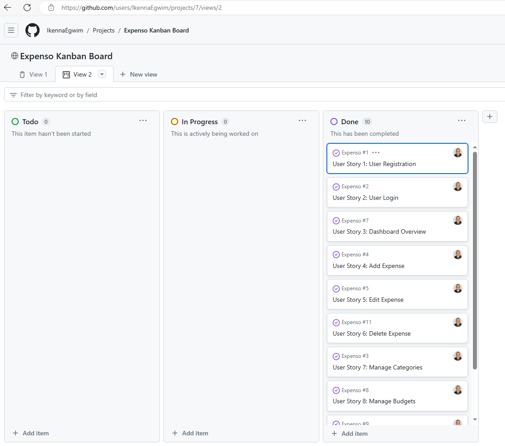
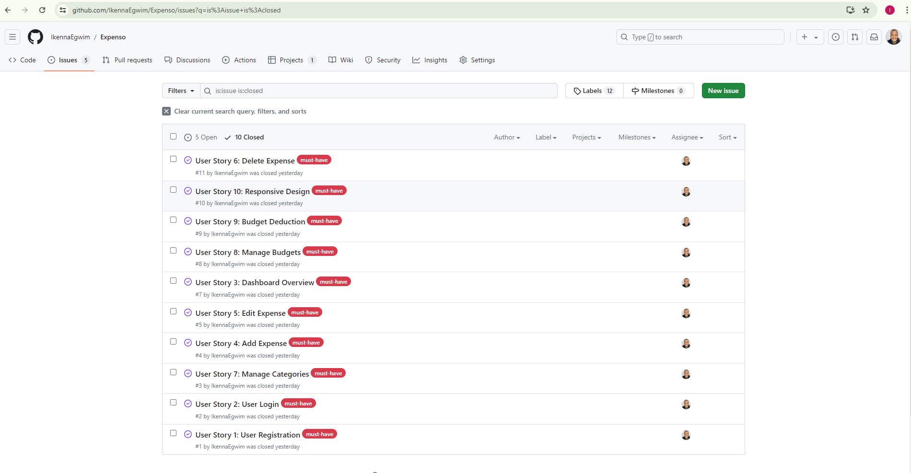

<!--
*** Thank you for checking out and/or using this project. If you have a suggestion
*** that would make this better, please fork the repo and create a pull request
*** or simply open an issue with the tag "improvement".
*** Don't forget to give the project a star!
-->

<!-- PROJECT LOGO -->
 

  <a href="https://github.com/IkennaEgwim/Expenso">
    
    

  </a>
    
  <h1 align="center">Expenso - Your Ultimate Expense Tracker</h1>

  

Expenso is the perfect tool for tracking expenses, managing budgets, and gaining financial insights. Whether for personal use or managing household expenses, Expenso helps you stay on top of your finances effortlessly.

**Key Features**
- Expense Tracking: Easily log and categorize daily expenses.
- Budget Management: Set and monitor monthly budgets with alerts for overspending.
- User-Friendly Interface: Enjoy a seamless experience across all devices with Expenso's responsive design.
- Secure and Private: Robust security measures ensure your data is safe and accessible only to you.
- Reports and Visualizations: Generate detailed reports, view spending charts (coming soon).
  
The live application can be viewed here :  [expenso website](https://expenso-f0dd67831327.herokuapp.com/accounts/login/?next=/)

# Purpose and Target Audience:

**Problem Statement:**
Many individuals struggle to track expenses, manage budgets, and gain financial insights, leading to overspending and difficulty achieving financial goals.

**Purpose:**
Expenso provides an easy-to-use, accessible platform for expense tracking, budget management, and financial analysis, helping users make informed decisions and improve their financial health.

**Target Audience:**
Tech-savvy adults aged 25-40, including young professionals, couples, and small families, who want to take control of their finances and work towards financial goals.

# Persona and User Stories:

Sarah, 28, is a busy marketing professional seeking better financial control. She uses Expenso to:

- Track daily expenses across devices
- View her financial status on a personalized dashboard
- Add, edit, and delete expenses and categories
- Set and monitor monthly budgets
- Gain insights into spending habits

Expenso helps Sarah manage her finances efficiently, reduce unnecessary spending, and work towards her goal of saving for a home. The app's user-friendly interface and cross-device accessibility fit well with her active lifestyle, allowing her to make informed financial decisions on the go.

## User Stories:

* As a new user, I want to register for an account so that I can start using the Expenso application to track my expenses and manage my budget.
* As a registered user, I want to log in to my account so that I can access my personalized dashboard and manage my expenses and budget.
* As a logged-in user, I want to view an overview of my expenses and budget on the dashboard so that I can quickly see my financial status and make informed decisions.
* As a user, I want to add a new expense with details such as amount, date, category, and notes, so that I can keep track of my spending accurately.
* As a user, I want to edit an existing expense, so that I can correct any mistakes or update the details as needed.
* As a user, I want to delete an expense, so that I can remove any incorrect or unnecessary records from my expense list.
* As a user, I want to add, edit, and delete expense categories, so that I can organize my expenses into relevant categories for better tracking.
* As a user, I want to set, edit, and delete monthly budgets for different categories so that I can manage my spending limits and stay within my financial goals.
* As a user, I want to see the remaining budget for each category after expenses are deducted, so that I can monitor my spending and adjust my habits accordingly.
* As a user, I want to access the Expenso application on different devices, including mobile and desktop so that I can manage my expenses and budget on the go with a consistent and user-friendly interface.
* Expense Visualization: Interactive charts and graphs to visualize spending patterns (coming soon).

## Wireframe & Initial Design:
### Login Page

### (Logged in) Browse books

### Add a Book

### Book Detail Page

## Project Management and Development Approach:

This project was implemented using the Agile Manifesto methodology. Below are the ways this project adhered to the 4 core values and 12 core principles of the aforementioned method:

<strong>Four Values of the Agile Manifesto:</strong>

- Vision 1: Customer collaboration over contract negotiation: I worked with four(4) cohort mates who are my imaginary customers. We held **10** meetings through Google Meet Platform, ensuring alignment with user needs and prioritizing features through user story mapping.
 

- Vision 2: Responding to change over following a plan: Throughout the project, I managed
   +  GitHub issues, adapting to changing requirements and feedback iteratively.
 

- Vision 3: Working software over comprehensive documentation: I achieved **15 story points** across **1 sprint**, emphasizing the focus on delivering functional software increments.
 

<strong>A screenshot of Kanban Board.</strong>

 

<strong>A screenshot of Issues used to create User Stories</strong>

 
- Vision 4: Individuals and interactions over processes and tools: Daily interactions on GitHub led to over **65 commits**, fostering collaboration and knowledge sharing among team members.
 

<strong>Twelve Principles of the Agile Manifesto</strong>

- Satisfy the customer: Held regular meetings to ensure alignment with user stories.
- Deliver working software: Prioritized delivering functional increments in each sprint, allowing for early feedback.
- Welcome changing requirements: Maintained open communication channels and adapted plans iteratively.
- Collaborate daily: Conducted daily standup, catchup and stand-down to facilitate collaboration and problem-solving.
- Face-to-face conversation: Utilized over 15 virtual meetings through slack huddle to enhance clarity and understanding.
- Motivated individuals: Empowered team members through skill development and recognition.
- Measure progress through working product: Evaluated progress based on delivered functionality in each sprint.
- Promote sustainable development: Prioritized sustainability practices to ensure long-term success.
- Simplicity is essential: Used MoSCoW prioritization and focused on MVP delivery to avoid unnecessary complexity.
- Continuous attention to technical excellence: Adopted show and tell technique to ensure all team members learn while collaborating.
- Self-organizing team: Encouraged autonomy and collaboration within the team.
- Regular reflection on continuous improvement: Conducted regular retrospectives to identify areas for improvement.

(<a href="#readme-top">back to top</a>)

# Design Choices:

## Colour scheme:

#fafafa - Header

Dark Green - Buttons

#809977 - Footer

The colours were selected with the intention of complementing the hero image and the idea was to ensure the image was appreciated.

## Typography:
 The following fonts were chosen for a clean and modern look that is both readable and minimal.

Varta

Goudy Book Letter 1911

## Priority Features:

### Home Page:

#### Navbar & Hero Image:

The landing page provides an introduction to the website with a call to action button encouraging new users to sign up. Signing up and logging in allows them access to view the available books and to add a book to the collection.
The navigation bar is valuable for users as it provides quick and easy access to important sections of the website. The navigation bar includes links to Home, Books, Add a Book, Register/Logout and Sign In. Displaying a hero image using graphics are both aesthetic and a nod to the repurposed phone booths that have been transformed into local libraries around the world.

#### Registration:

Registration allows users to view the available books and the relevant book details at The Book Booth library. It allows them to add a book as well as edit and delete their addition to ensure the book collection available is updated regularly. 

#### Sign In:

#### Books:

#### Add a Book:

The form allows users to easily add a book to the library which will then be visible on the  books page for the users to browse. Users are also able to edit and delete a book they themselves have added giving them full control over their own contributions.

#### Book Details:

Users are able to find more information about the book they are interested in. The book details include the title, author and a brief summary of the book along with an book cover image. This provides users with sufficient information about the book.

#### Footer:

Links in the footer redirect to respective social media pages. 
It allows users to stay connected with the The Book Booth on social media platforms, keeping them informed about any changes that may occur over time.

# Future Features:

* Implement a review system so readers can share their thoughts about books that they have completed. This will give others a better idea of whether the book is a good fit for them. 
* Display if a book is available with a status (Available, Not Available).
*  Allow users to reserve a book beforehand.
* A search engine where users can search for books by title, author and genre.
* Provide locations of nearest libraries.
* Provide a way for the users to engage and form a secure community.
* Include an about page to inform others of how The Book Booth Library works and how to use it.

Database Design:

Entity Relationship Diagrams (ERD) help the developer to make connections between databases and information. Creating an ERD helped me understand how the tables relate to one another. I used LucidChart to create the diagram and the arrow represent how the data fields relate to one another.

## Data Models:

| Book   |            |   |
|----------|:-------------:|------:|
| Title |  CharField |  |
| Author |  CharField   |   FK |
| ISBN | CharField |     |
| User |  CharField | FK |
| Genre |  CharField   |   FK |
| Language | CharField |  FK   |
| Summary |  TextField |  |

| Genre   |            |   |
|----------|:-------------:|------:|
| Category |  CharField | FK |

| Language   |            |   |
|----------|:-------------:|------:|
| Language |  CharField | FK  |

| Author  |            |   |
|----------|:-------------:|------:|
| Name |  CharField | FK  |

## User Flow Chart:

The Flowchart served as an efficient way to make important decisions when creating the app. It helped me narrow down which decisions were important for the users and admin as well as establishing the appropriate authentication. It also helped me decide which features were the most important i.e adding a book and viewing a list of books that are available to borrow at The Book Booth Library.

# Validation
## HTML

| Page | W3C URL | Screenshot | Notes |
| --- | --- | --- | --- |
| Home | [W3C](https://validator.w3.org/nu/?doc=https%3A%2F%2Fthebookbooth1-559d9131718c.herokuapp.com%2F) |  | Pass: button is a descendant of a tag |
| Books | [W3C](https://validator.w3.org/nu/?doc=https%3A%2F%2Fthebookbooth1-559d9131718c.herokuapp.com%2Fbooks%2Fbooks%2F) |  | Pass: No Errors |
| Add a Book | [W3C](https://validator.w3.org/nu/?doc=https%3A%2F%2Fthebookbooth1-559d9131718c.herokuapp.com%2Fbooks%2Fadd_book%2F) |  | Pass: No Errors |
| Sign In| [W3C](https://validator.w3.org/nu/?doc=https%3A%2F%2Fthebookbooth1-559d9131718c.herokuapp.com%2Faccounts%2Flogin%2F) |  | Pass: No Errors |
| Register| [W3C](https://validator.w3.org/nu/?doc=https%3A%2F%2Fthebookbooth1-559d9131718c.herokuapp.com%2Faccounts%2Fsignup%2F) |  | unclosed elements main and div |

 ## CSS

 I have used the recommended [CSS Jigsaw Validator](https://jigsaw.w3.org/css-validator) to validate my CSS file.
 
| File | Jigsaw URL | Screenshot | Notes |
| --- | --- | --- | --- |
| style.css | [Jigsaw](https://jigsaw.w3.org/css-validator/validator?uri=https%3A%2F%2Fthebookbooth1-559d9131718c.herokuapp.com%2F&profile=css3svg&usermedium=all&warning=1&vextwarning=&lang=enhttps://jigsaw.w3.org/css-validator/validator) |  | Pass: No Errors |

## Python

I have used the recommended [PEP8 CI Python Linter](https://pep8ci.herokuapp.com) to validate all of my Python files.

| File | CI URL | Screenshot | Notes |
| --- | --- | --- | --- |
| forms.py | [PEP8 CI](https://pep8ci.herokuapp.com/https://raw.githubusercontent.com/hiboibrahim/thebookbooth1/main/run.py) | ![screenshot]
 | Pass: No Errors |
| settings.py | [PEP8 CI](https://pep8ci.herokuapp.com/https://raw.githubusercontent.com/hiboibrahim/thebookbooth1/main/boutique-ado/settings.py) | ![screenshot]
 | Pass: No Errors |
| Book views.py | [PEP8 CI](https://pep8ci.herokuapp.com/https://raw.githubusercontent.com/hiboibrahim/thebookbooth1/main/blog/views.py) | ![screenshot]
 | Pass: No Errors |
| Book urls.py | [PEP8 CI](https://pep8ci.herokuapp.com/https://raw.githubusercontent.com/hiboibrahim/thebookbooth1/main/checkout/urls.py) | ![screenshot]
 | Pass: No Errors |
|  models.py | [PEP8 CI](https://pep8ci.herokuapp.com/https://raw.githubusercontent.com/hiboibrahim/thebookbooth1/main/profiles/models.py) | ![screenshot]
 | Pass: No Errors |

# Responsiveness:
Development tools were used to test responsiveness on varying sized devices including laptop, mobile and tablet size.

Full testing was performed on the following devices:

Laptops:

* Macbook Air 2018 13.3-inch screen
* Lenovo Thinkpad 14" screen

 Mobile Devices:
* Google Pixel 4a

 * Browser Compatibility:
 
 I have tested the site using the following browsers:

* Google Chrome

* Microsoft Edge

I can confirm that the site is responsive and looks as expected good on different screen sizes.

Mobile devices:

Tablet Devices:

# Testing:

## Lighthouse Audit:

I've tested my deployed project using the Lighthouse Audit tool to check for any major issues.

* On a laptop:

Home

Books 

Add a book 

On a mobile device:

Home 

Books

Add a book 

## Links

| Link | Expected Outcome | Grade |
| ------- | ---------------- | ----- |
| Logo | Navigates to the home page when clicked | Fail |
| Home | Navigates to the home page when clicked | Pass |
| Books | Navigates to a book list  page when clicked | Pass |
| Add a Book | Navigates to a form to add a book when clicked | Pass |
| Register | Navigates to a registration form when clicked | Pass |
| Log in | Navigates to a screen where users can log in when clicked | Pass |
| Logout | Navigates to a page confirming for the user to log out | Pass |

## Testing 

| Feature | Expected Outcome | Grade | Screenshots |
| ------- | ---------------- | ----- | --------- |
| Modal | A message will appear informing the user of a successful action | Pass | 
| User logged in | Text displays the user logged in with their username | Pass | 
| View books | Users can see available books which have been added | Pass | 
| Add a book | Add a book to the book collection that will be available to borrow | Pass | 
| Admin has access to crud functionality of all additions | Admin can edit or delete any book addition | Pass | 
| Edit a book | A user can edit the details on the book that they have addded. It will update their addition on the books page | Pass | 
| Delete a book | A user who added a book OR an admin can delete a book. It will then be deleted from the DB | Pass | 
| Registration | New users can access a registration form from the "Register" link | Pass | 
| Log in | Users can log in using a form after clicking "Log in" | Pass | 
| Log out | Users get logged out after clicking "Log out" | Pass | 
| Grid display | A CSS grid will display the books in a clear, responsive format | Pass | N/A
| Functional buttons | Edit, delete, create buttons will be functional throughout the site | Pass | 
| Footer | A footer displays social information | Pass | 
| Social links work | The social links will navigate to a new page when they're clicked. They will open in a new tab | Pass | 

# Tools and Technologies Used:
The technologies implemented in this application included HTML5, CSS, Bootstrap, Python and Django.

* Python used as the back-end programming language.
* Git used for version control. (git add, git commit, git push)
* GitHub used for secure online code storage.
* GitHub Pages used for hosting the deployed front-end site.
* Gitpod used as a cloud-based IDE for development.
* Bootstrap used as the front-end CSS framework for modern responsiveness and pre-built components.
* ElephantSQL used as the Postgres database.
* Heroku used for hosting the deployed back-end site.
* Cloudinary used for online static file storage.
* Canva Utilized for collaborative design and prototyping(wireframes).

* Google and Stack Overflow utilized for general research or solving a bug, information gathering, and various online tools.

# Languages Used:
* HTML5
* CSS
* Python

# Deployment :

I used the steps used when deploying our django blog to deploy this application. The instructions for this mainly came from the follow along videos and text-steps provided on the code institute LMS.

# Bugs

All the bugs that occured during the creation of this application have been resolved. There is a section of the application which allows you to reset your password that needs to be implemented, however they were not within the scope of this particular project and will be addressed in the near future along with the other future features.

# Credit: 

* Although I used the django blog resources provided on the LMS, I also received alot of additional clarification by following along with django projects on YouTube. One of the vidoes I found especially helpful was : https://youtu.be/JzDBCZTgVyw?si=w3BBwJswUjBTm1xw

* Stack Overflow was used to solve any smaller bugs and further clarification on errors I was receiving in the terminal.

* I used this site to generate a persona and created user stories: https://founderpal.ai/user-persona-generator

* A special thanks to all the other indivudals in our cohort for their continuous support throughout the course.

* The added book covers and details were taken from the Waterstones Website.

* Font Awesome was used for icons and the fonts used were derived from Google Fonts.

* Wireframes, logo and flowcharts were created using Canva. 
