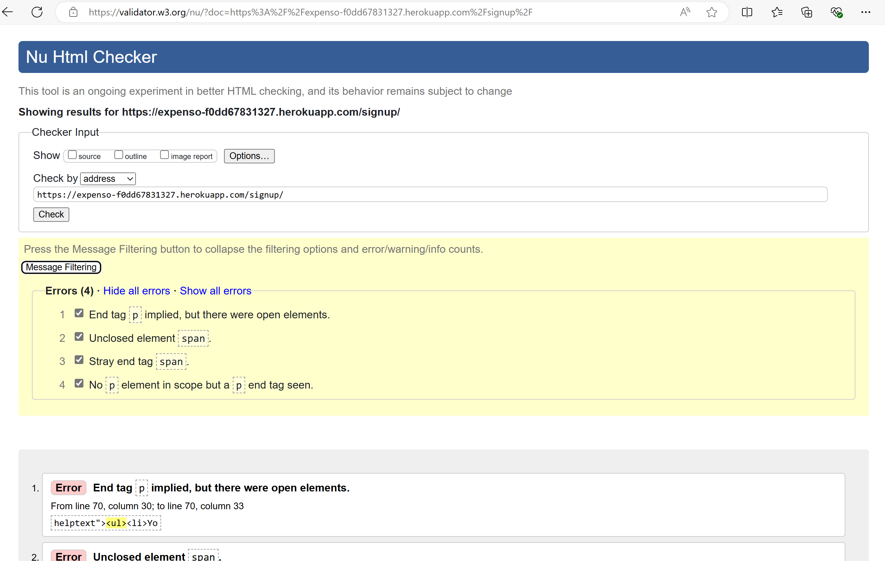
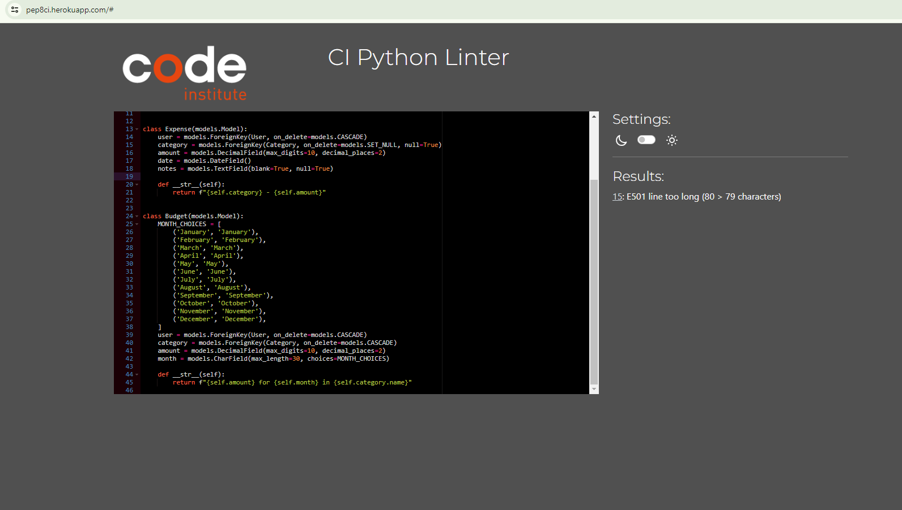

<!--
*** Thank you for checking out and/or using this project. If you have a suggestion
*** that would make this better, please fork the repo and create a pull request
*** or simply open an issue with the tag "improvement".
*** Don't forget to give the project a star!
-->

<!-- PROJECT LOGO -->
 

  <a href="https://github.com/IkennaEgwim/Expenso">
    
    

  </a>
    
  <h1 align="center">Expenso - Your Ultimate Expense Tracker</h1>

  

  

Expenso is the perfect tool for tracking expenses, managing budgets, and gaining financial insights. Whether for personal use or managing household expenses, Expenso helps you stay on top of your finances effortlessly.

**Key Features**
- Expense Tracking: Easily log and categorize daily expenses.
- Budget Management: Set and monitor monthly budgets with alerts for overspending.
- User-Friendly Interface: Enjoy a seamless experience across all devices with Expenso's responsive design.
- Secure and Private: Robust security measures ensure your data is safe and accessible only to you.
- Reports and Visualizations: Generate detailed reports, view spending charts (coming soon).
  
The live application can be viewed here :  [expenso website](https://expenso-f0dd67831327.herokuapp.com/accounts/login/?next=/)

Feel free to test the app using the provided test credentials:

- Login: user3
- Password: Pa55word!

# Purpose and Target Audience:

**Problem Statement:**
Many individuals struggle to track expenses, manage budgets, and gain financial insights, leading to overspending and difficulty achieving financial goals.

**Purpose:**
Expenso provides an easy-to-use, accessible platform for expense tracking, budget management, and financial analysis, helping users make informed decisions and improve their financial health.

**Target Audience:**
Tech-savvy adults aged 25-40, including young professionals, couples, and small families, who want to take control of their finances and work towards financial goals.

# Persona and User Stories:

Sarah, 28, is a busy marketing professional seeking better financial control. She uses Expenso to:

- Track daily expenses across devices
- View her financial status on a personalized dashboard
- Add, edit, and delete expenses and categories
- Set and monitor monthly budgets
- Gain insights into spending habits

Expenso helps Sarah manage her finances efficiently, reduce unnecessary spending, and work towards her goal of saving for a home. The app's user-friendly interface and cross-device accessibility fit well with her active lifestyle, allowing her to make informed financial decisions on the go.

## User Stories:

* As a new user, I want to register for an account so that I can start using the Expenso application to track my expenses and manage my budget.
* As a registered user, I want to log in to my account so that I can access my personalized dashboard and manage my expenses and budget.
* As a logged-in user, I want to view an overview of my expenses and budget on the dashboard so that I can quickly see my financial status and make informed decisions.
* As a user, I want to add a new expense with details such as amount, date, category, and notes, so that I can keep track of my spending accurately.
* As a user, I want to edit an existing expense, so that I can correct any mistakes or update the details as needed.
* As a user, I want to delete an expense, so that I can remove any incorrect or unnecessary records from my expense list.
* As a user, I want to add, edit, and delete expense categories, so that I can organize my expenses into relevant categories for better tracking.
* As a user, I want to set, edit, and delete monthly budgets for different categories so that I can manage my spending limits and stay within my financial goals.
* As a user, I want to see the remaining budget for each category after expenses are deducted, so that I can monitor my spending and adjust my habits accordingly.
* As a user, I want to access the Expenso application on different devices, including mobile and desktop so that I can manage my expenses and budget on the go with a consistent and user-friendly interface.
* As a user, I want to access interactive charts and graphs to visualize spending patterns (coming soon).

## Wireframe & Initial Design:
### Login Page

### (Logged in) Dashboard

### (Mobile View) Add Expense

## Project Management and Development Approach:

This project was implemented using the Agile Manifesto methodology. Below are the ways this project adhered to the 4 core values and 12 core principles of the aforementioned method:

<strong>Four Values of the Agile Manifesto:</strong>

- Vision 1: Customer collaboration over contract negotiation: I worked with four(4) cohort mates who are my imaginary customers. We held **10** meetings through Google Meet Platform, ensuring alignment with user needs and prioritizing features through user story mapping.
 

- Vision 2: Responding to change over following a plan: Throughout the project, I managed
   +  GitHub issues, adapting to changing requirements and feedback iteratively. 
 

- Vision 3: Working software over comprehensive documentation: I achieved **15 story points** across **1 sprint**, emphasizing the focus on delivering functional software increments.
 

<strong>A screenshot of Kanban Board.</strong>

 
 

<strong>A screenshot of Issues used to create User Stories</strong>

 
- Vision 4: Individuals and interactions over processes and tools: Daily interactions on GitHub led to over **65 commits**, fostering collaboration and knowledge sharing among team members.

 

<strong>Twelve Principles of the Agile Manifesto</strong>

- Satisfy the customer: Held regular meetings to ensure alignment with user stories.
- Deliver working software: Prioritized delivering functional increments in each sprint, allowing for early feedback.
- Welcome changing requirements: Maintained open communication channels and adapted plans iteratively.
- Collaborate daily: Conducted daily standup, catchup and stand-down to facilitate collaboration and problem-solving.
- Face-to-face conversation: Utilized over 15 virtual meetings through slack huddle to enhance clarity and understanding.
- Motivated individuals: Empowered team members through skill development and recognition.
- Measure progress through working product: Evaluated progress based on delivered functionality in each sprint.
- Promote sustainable development: Prioritized sustainability practices to ensure long-term success.
- Simplicity is essential: Used MoSCoW prioritization and focused on MVP delivery to avoid unnecessary complexity.
- Continuous attention to technical excellence: Adopted show and tell technique to ensure all team members learn while collaborating.
- Self-organizing team: Encouraged autonomy and collaboration within the team.
- Regular reflection on continuous improvement: Conducted regular retrospectives to identify areas for improvement.

(<a href="#readme-top">back to top</a>)

<h1 id="design-and-styling">Design and Styling</h1>

<h3 id="design">Design:</h3>

The design chosen for this project is a clean, modern, and professional look that ensures ease of use and readability. This approach is beneficial for a financial management tool, as it emphasizes clarity and organization, which are crucial for tracking expenses and managing budgets.

<h3 id="color">Colour Scheme:</h3>

**1.  Blue (#007BFF):** This color was chosen as it conveys trust, reliability, and professionalism. Blue is calming and promotes a sense of order and efficiency, essential for a financial management application.

**2. Green (#00FF00):** This is our brand color as we choose it as it symbolizes growth, harmony, and stability. Green is often associated with money and financial success, making it ideal for emphasizing the application's focus on financial management.

**3. Yellow (#FFC107):** Draws attention to important interactive elements. Yellow is vibrant and energetic, creating a sense of warmth and friendliness that enhances user engagement.

**4. Medium Gray (#6C757D):** Provides a neutral and calm backdrop that supports readability and focus. Medium gray maintains a sophisticated and professional look, adding contrast and depth to the design.

<h3 id="font">Font:</h3>

**Main font:**  Roboto

**Secondary font:** N/A (Roboto is used uniformly across the application for consistency and readability)

Roboto is a modern, clean, and highly readable font. It works well in digital interfaces and ensures good readability across various screen sizes and resolutions.

# Features

### Login Page:

The login/landing page provides a welcoming header and a brief introduction to the application, highlighting its purpose. The user navigates to the login page, enters username and password, then submits the form. If credentials are correct, user is directed to the dashboard. It also provides a link for the user to sign up of they don't have an account.

#### Features of the Login Page:
- User Authentication: Allows users to enter their username and password to log in.
- Form Validation: Ensures that the fields are filled out before submission.
- Error Handling: Displays an error message if the login credentials are incorrect.
- Navigation: Provides a link to the signup page for new users.

### Sign Up:

The sign up page allows users to create an account to be able to use the application. New user navigates to the signup, fills out the registration form (no email required) and submits the form. Account is created and user receives a success message. User is automatically logged in and redirected to their dashbaord, where they can begin add expense, create category or add a budget. 

#### Features of the Sign Up page:
- User Registration: Allows new users to create an account by providing a username and password.
- Form Validation: Ensures all fields are correctly filled before submission.
- Navigation: Provides a link to the login page for existing users.

### Dashboard:

The dashboard page provides an overview of the user's financial status, recent expenses and budget performance. The user is redirected here once they log in, and from here the user can navigate to different sections using the provided links. 

#### Features of the Dashboard page:
- Overview: Provides an overview of the user's financial status, recent expenses, and budget performance.
- Navigation Links: Quick access to add expenses, manage categories, and manage budgets.
- Charts and Graphs: Visual representation of expenses and budget data (coming soon).

### Add Expense:

The form allows users to easily add a new expense which will then be visible on the Dashboard page. Users are also able to edit and delete an expense on the dashboard giving them full control of the application. 

The flow is as follows:
- User navigates to the add expense page from the dashboard or navbar.
- User fills out the expense form.
- User submits the form.
- Expense is added to the user's record, and user is redirected back to the dashboard or receives a success message.

#### Features of the Add Expense page:
- Expense Form: Allows users to enter details of a new expense including amount, category, and date.
- Form Validation: Ensures all required fields are filled out correctly.
- Submission Handling: Processes the form data and adds the expense to the user's records.

### Manage Categories:

Users are able to add new categories, edit or delete existing categories for better financial management. The changes made here are saved and the updated list is displayed.

#### Features of the Manage Categories page:
- Add Category: Allows users to create new categories for expenses.
- Existing Categories List: Displays a list of existing categories with options to edit or delete.
- Form Validation: Ensures the new category name is provided.

### Manage Budgets:

The Manage Budgets page allows users to set new budgets using the provided form. Here users can also edit or delete existing budgets, with changes saved and the updated budget list displayed.

#### Features:
- Add Budget: Allows users to set a budget for different categories.
- Existing Budgets List: Displays a list of existing budgets with options to edit or delete.
- Form Validation: Ensures all required fields are filled out correctly.

## Future Features:

- Expense Reports: Generate detailed expense reports for any given period.
- Notifications: Alerts for budget thresholds and other important updates.
- Localization: Multi-language support for a global user base.
- Charts and Visualisation: Interactive charts and graphs to visualize spending patterns

## Database Design:

Entity Relationship Diagrams (ERD) help the developer to make connections between databases and information. Creating an ERD helped me understand how the tables relate to one another. I used LucidChart to create the diagram and the arrow represent how the data fields relate to one another.

## Data Models:

| User   |            |   |
|----------|:-------------:|------:|
| id |  Autofield |  PK|
| username |  CharField   |   FK |
| email | EmailField |     |
| password |  CharField | FK |

| Expense   |            |   |
|----------|:-------------:|------:|
|id |  Autofield |  PK |
| user |  CharField   |   FK |
| amount |  DecimalField   |    |
| description | CharField |    |
| date |  DateTimeField   |    |
| category |  CharField | FK |

| Category   |            |   |
|----------|:-------------:|------:|
|id |  Autofield |  PK |
| user |  CharField   |   FK |
| name |  CharField   |    |

| Budget  |            |   |
|----------|:-------------:|------:|
|id |  Autofield |  PK |
| user |  CharField   |   FK |
| category |  CharField | FK  |
| amount |  DecimalField  |    |
| month |  CharField  |    |

## User Flow Chart:

The Flowchart served as an efficient way to make important decisions when creating the app. It helped me narrow down which decisions were important for the users and admin as well as establishing the appropriate authentication. It also helped me decide which features were the most important.

# Validation

## HTML

| Page | Expenso W3C URL | Screenshot | Notes |
| --- | --- | --- | --- |
| Login (Home)  | [W3C](https://validator.w3.org/nu/?doc=https%3A%2F%2Fexpenso-f0dd67831327.herokuapp.com%2Faccounts%2Flogin%2F) |  | Pass: no errors |
| Sign Up | [W3C](https://validator.w3.org/nu/?doc=https%3A%2F%2Fexpenso-f0dd67831327.herokuapp.com%2Fsignup%2F) |  | Undisclosed elements and tag |
| Dashboard | [W3C](https://validator.w3.org/nu/?doc=https%3A%2F%2Fexpenso-f0dd67831327.herokuapp.com%2F) |  | Pass: No Errors |
| Add_Expense | [W3C](https://validator.w3.org/nu/?doc=https%3A%2F%2Fexpenso-f0dd67831327.herokuapp.com%2Fadd-expense%2F) |  | Pass: No Errors |
| Manage_Categories| [W3C](https://validator.w3.org/nu/?doc=https%3A%2F%2Fexpenso-f0dd67831327.herokuapp.com%2Fmanage-categories%2F) |  | Pass: No Errors |
| Manage_Budgets| [W3C](https://validator.w3.org/nu/?doc=https%3A%2F%2Fexpenso-f0dd67831327.herokuapp.com%2Fmanage-budgets%2F) |  | Pass: No Errors |

 ## CSS

 I have used the recommended [CSS Jigsaw Validator](https://jigsaw.w3.org/css-validator) to validate my CSS file.
 
| File | Expenso Jigsaw URL | Screenshot | Notes |
| --- | --- | --- | --- |
| style.css | [Jigsaw](https://jigsaw.w3.org/css-validator/validator?uri=https%3A%2F%2Fexpenso-f0dd67831327.herokuapp.com%2F&profile=css3svg&usermedium=all&warning=1&vextwarning=&lang=en) |  | Pass: No Errors |

## Python

I have used the recommended [PEP8 CI Python Linter](https://pep8ci.herokuapp.com) to validate all of my Python files.

| File | CI URL | Screenshot | Notes |
| --- | --- | --- | --- |
| forms.py | [PEP8 CI](https://pep8ci.herokuapp.com) | | Pass: No Errors |
| settings.py | [PEP8 CI](https://pep8ci.herokuapp.com) |  | Pass: E501 line too long |
| views.py | [PEP8 CI](https://pep8ci.herokuapp.com) | | Pass: E501 line too long |
| urls.py | [PEP8 CI](https://pep8ci.herokuapp.com) | | Pass: E501 line too long|
|  models.py | [PEP8 CI](https://pep8ci.herokuapp.com) | | Pass: No Errors |

# Responsiveness:
Development tools were used to test responsiveness on varying sized devices including laptop, mobile and tablet size.

Full testing was performed on the following devices:

Laptops:

* Macbook Air 2018 13.3-inch screen
* Lenovo Thinkpad 14" screen

 Mobile Devices:
* Google Pixel 4a

 * Browser Compatibility:
 
 I have tested the site using the following browsers:

* Google Chrome

* Microsoft Edge

I can confirm that the site is responsive and looks as expected good on different screen sizes.

Mobile devices:

Tablet Devices:

# Testing:

## Lighthouse Audit:

I've tested my deployed project using the Lighthouse Audit tool to check for any major issues.

* On a laptop:

Home

Books 

Add a book 

On a mobile device:

Home 

Books

Add a book 

## Links

| Link | Expected Outcome | Grade |
| ------- | ---------------- | ----- |
| Logo | Navigates to the home page when clicked | Fail |
| Home | Navigates to the home page when clicked | Pass |
| Books | Navigates to a book list  page when clicked | Pass |
| Add a Book | Navigates to a form to add a book when clicked | Pass |
| Register | Navigates to a registration form when clicked | Pass |
| Log in | Navigates to a screen where users can log in when clicked | Pass |
| Logout | Navigates to a page confirming for the user to log out | Pass |

## Testing 

| Feature | Expected Outcome | Grade | Screenshots |
| ------- | ---------------- | ----- | --------- |
| Modal | A message will appear informing the user of a successful action | Pass | 
| User logged in | Text displays the user logged in with their username | Pass | 
| View books | Users can see available books which have been added | Pass | 
| Add a book | Add a book to the book collection that will be available to borrow | Pass | 
| Admin has access to crud functionality of all additions | Admin can edit or delete any book addition | Pass | 
| Edit a book | A user can edit the details on the book that they have addded. It will update their addition on the books page | Pass | 
| Delete a book | A user who added a book OR an admin can delete a book. It will then be deleted from the DB | Pass | 
| Registration | New users can access a registration form from the "Register" link | Pass | 
| Log in | Users can log in using a form after clicking "Log in" | Pass | 
| Log out | Users get logged out after clicking "Log out" | Pass | 
| Grid display | A CSS grid will display the books in a clear, responsive format | Pass | N/A
| Functional buttons | Edit, delete, create buttons will be functional throughout the site | Pass | 
| Footer | A footer displays social information | Pass | 
| Social links work | The social links will navigate to a new page when they're clicked. They will open in a new tab | Pass | 

# Tools and Technologies Used:
The technologies implemented in this application included HTML5, CSS, Bootstrap, Python and Django.

* Python used as the back-end programming language.
* Git used for version control. (git add, git commit, git push)
* GitHub used for secure online code storage.
* GitHub Pages used for hosting the deployed front-end site.
* Gitpod used as a cloud-based IDE for development.
* Bootstrap used as the front-end CSS framework for modern responsiveness and pre-built components.
* ElephantSQL used as the Postgres database.
* Heroku used for hosting the deployed back-end site.
* Cloudinary used for online static file storage.
* Canva Utilized for collaborative design and prototyping(wireframes).

* Google and Stack Overflow utilized for general research or solving a bug, information gathering, and various online tools.

# Languages Used:
* HTML5
* CSS
* Python

<h2 id="deployment-and-credits">SECTION 5: DEPLOYMENT AND CREDITS</h2>

In this section, I will outline the process of deploying the tested and validated product, as well as acknowledge the external resources and inspirations utilized during this exercise.

<h2 id="final-product">Final Product</h2>

The product is live and can be seen on **[url of deployed site]**

### _Home Page_

Here are some screenshots of various sections of the final product:

### _Task Management Page_

### _Dashboard_

- Add images of other relevant sections of the final product as shown above.

<h2 id="deployment-process">Deployment Process</h2>

The deployment process for Tasktopia involved several steps to ensure that the application is running smoothly on a live server. Here's an overview of the steps I followed:

1. **Preparing the Environment:**

   - Ensured that all necessary dependencies were listed in the `requirements.txt` file.
   - Set up environment variables for sensitive information like database credentials and API keys.

2. **Choosing a Hosting Service:**
   - Selected [Heroku](https://www.heroku.com/) for deploying the application due to its ease of use and support for Python applications.
3. **Deploying the Application:**

   - Pushed the code to a GitHub repository.
   - Connected the GitHub repository to Heroku.
   - Configured the Heroku environment with necessary buildpacks and settings.
   - Deployed the application directly from the GitHub repository.

4. **Testing the Live Application:**
   - Conducted thorough testing on the live application to ensure all features were working as expected.
   - Fixed any issues that arose during the live testing phase.

### Deployment via Heroku

Deploying Tasktopia to Heroku was a straightforward and efficient process. Here’s a brief overview of the steps I followed:

1. **Create a Heroku Account:**

   - I signed up for a Heroku account at [Heroku's website](https://www.heroku.com/).

2. **Install Heroku CLI:**

   - I installed the Heroku Command Line Interface (CLI) on my local machine to manage the deployment process.

3. **Prepare the Application for Heroku:**

   - Added a `Procfile` to specify the commands Heroku should run to start the application.
   - Included `requirements.txt` and `runtime.txt` files to specify dependencies and the Python version.

4. **Deploy the Application:**

   - Logged into Heroku using the CLI: `heroku login`
   - Created a new Heroku app: `heroku create`
   - Pushed the code to Heroku: `git push heroku main`
   - Configured environment variables via the Heroku dashboard or CLI.

5. **Monitor and Manage:**
   - Used the Heroku dashboard to monitor the application’s performance and logs.
   - Made necessary adjustments to ensure the application runs smoothly on the live server.

<h2 id="credits">Credits</h2>

<h3 id="template">Template</h3>

- This template was adopted and adapted from README.md templates published by [Chibueze C. Igwe](https://github.com/scientistigwe/README-Template)
* Although I used the django blog resources provided on the LMS, I also received alot of additional clarification by following along with django projects on YouTube. One of the vidoes I found especially helpful was : https://youtu.be/JzDBCZTgVyw?si=w3BBwJswUjBTm1xw

* Stack Overflow was used to solve any smaller bugs and further clarification on errors I was receiving in the terminal.

* I used this site to generate a persona and created user stories: https://founderpal.ai/user-persona-generator

* A special thanks to all the other indivudals in our cohort for their continuous support throughout the course.

* The added book covers and details were taken from the Waterstones Website.

* Font Awesome was used for icons and the fonts used were derived from Google Fonts.

* Wireframes, logo and flowcharts were created using Canva. 

<h3 id="content">Content</h3>

- All content was written by **Chibueze C. Igwe**.

<h3 id="media2">Media</h3>

- All images used in the project were sourced from [Google Image Search](https://www.google.com).

<!-- ACKNOWLEDGMENTS -->
<h2 id="acknowledgments">Acknowledgments</h2>

I would like to extend my gratitude to the following resources that contributed significantly to the success of this project:

- [Choose an Open Source License](https://choosealicense.com)
- [GitHub Emoji Cheat Sheet](https://www.webpagefx.com/tools/emoji-cheat-sheet)
- [Malven's Flexbox Cheatsheet](https://flexbox.malven.co/)
- [Malven's Grid Cheatsheet](https://grid.malven.co/)
- [GitHub](https://pages.github.com)
- [Font Awesome](https://fontawesome.com)

<!-- CONTACT -->
<h2 id="contact">Contact</h2>

If you have any questions or feedback, feel free to reach out:

Project Link: [https://github.com/your_username/repo_name](https://github.com/your_username/repo_name)

(<a href="#readme-top">back to top</a>)

</section>

